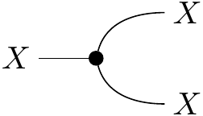
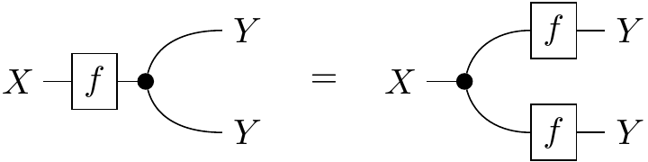

Adjoint School 2024 Subgroup 1B Blogpost

Drew, Nico, and Utku

# Introduction (this probably doesn't need a section title) (Drew)

We assume that the reader is familiar with symmetric monoidal categories and string diagrams. All of our string diagrams are to be read bottom to top.

* As said by Tomas, spell out the motivation here, and make sure readers know that there's a big reward at the end.
* Maybe an illustration? My motivator to learn this was the difference between the cumbersome algebra from my professor's notes (Section 9.4 of the attached estimation theory pdf) vs the simplicity of [Proposition 3.7 in this paper](https://arxiv.org/pdf/2401.14669)

# Basics of Probability Theory (UTKU)

Establish an example setting:

Weather, lawn sprinklers, and other

W = {Sunny, Cloudy, Rainy}
S = {On, Off}
P = {High, Low}
T = {Hot, Mild, Cold}

* Distributions
    * Show probability and possibility distributions in our example setting
    * Use bra-ket notation from example 2.4 in [this paper](https://arxiv.org/pdf/1709.00322)
* Markov Kernels
    * Probability and possibility
    * Show that these are Kleisli maps, segue into next section

# Kleisli Categories (Should this be a subsection of above?) (NICO)

* Example probability monads (Construct `flatten`, `dirac`, and `zipper` for each)
    * Finite distribution monad
    * Powerset monad
    * Briefly mention giry monad
* Kleisli categories
    * What structures do the Kleisli categories lose (and what do they keep) from their base (Cartesian) counterparts?
        * They do keep comonoid structures
        * But they're no longer Cartesian
        * Copy map is no longer natural
        * Products are no longer categorical products, ie. projections are no longer universal. What does this mean in terms of probability? (Answer: unlike Cartesian projection, you cannot in general reconstruct a joint probability distribution from its marginals)
        * Delete is still natural though, ie. unit object is still final
        * This all plays into "equivalent characterizations of deterministic Markov categories"

# Markov Categories

## Formal definition

Let's start with the terse definition that category theorists love so much: A Markov category is a semiCartesian category where every object is a comonoid compatible with the monoidal structure.

(Now give a more explicit definition. Should we give both string diagram equations and commutative diagrams? Or just stick to one?)

## Each Axiom Explained

Let's go a little bit more in-depth into why each of these axioms are required.
(Bring in our established example setting into each of the subsections below.)

### Composition and Identity (Utku)

We want to describe how to "push forward" distributions

### Monoidal Products (Nico)

We want to describe distributions over joint variables.

### Swap Map (Drew)

### Copy Map (Drew)

We want this because it makes sense to process the same data in multiple different ways and then compare them.
Show for instance the "graph" of a morphism

Why should this be compatible with the monoidal structure?

Now if we remember, every object $$X$$ in a Markov category is a comonoid, meaning that it's equipped with a comultiplication morphism $$\mathrm{copy}_X :X \rightarrow X\otimes X$$, which we'll give the following string diagram:

We can think of it as a Markov kernel that takes an input $$x \in X$$ and outputs a Dirac delta distribution on its diagonal, $$\delta_{(x,x)} \in X\otimes X$$.
In our example, the copy morphism on our set of weather conditions forms the following stochastic matrix:

[copy stochastic matrix]()

When a distribution is postcomposed with a copy, it will land on the diagonal in the joint space.
So for instance, if a distribution on weather states is $$p_W = 0.2 | \mathrm{Sunny} \rangle + 0.3 | \mathrm{Cloudy} \rangle + 0.5 | \mathrm{Rainy} \rangle$$, then we get $$\mathrm{copy}_W \circ p_W = 0.2 | \mathrm{(Sunny,Sunny)} \rangle + 0.3 | \mathrm{(Cloudy, Cloudy)} \rangle + 0.5 | \mathrm{(Rainy, Rainy)} \rangle$$

Cartesian categories come equipped with diagonal maps that do something very similar to this.
Paired with the projections, this makes all objects of Cartesian categories comonoids as well, and in fact all Cartesian categories are Markov categories, albeit probabilistically uninteresting ones since all morphisms are *deterministic* as we'll define later.
But if we have a probability monad on a Cartesian category, we can transport the diagonal maps into its Kleisli category, and these become precisely the copy maps.

Why do we want this comultiplication structure on our objects?
If we think of string diagrams as having pipes through which information flows, then it's useful to duplicate information and run different transformations on their parallel streams for comparison.
For instance, for a distribution $$p: I \rightarrow X$$ and kernel $$f: X \rightarrow Y$$, it's really common to generate a joint distribution on $$X$$s and $$Y$$s with the following diagram:

[graph state string diagram]()

We sometimes call this a graph state because it works the exact same way for sets: the graph of a function $$f:X\rightarrow Y$$ is the set of tuples $$\{ (x, f(x)) : x\in X\}$$. The appearance of $$x$$ twice means that it must have been passed through a copy map, and the tuple $$(-, f(-))$$ represents the map $$\mathrm{id}\times f$$.

### Delete Map (Nico)

In probability theory: marginalization.
In information processing:deleting information seems desirable (even though impossible in quantum information theory)

Why should it be natural? Equivalently, why should the tensor unit be terminal?
In this sense, why should del be compatible with the monoidal structure?

* This corresponds to normalization
* Deleting an output of a process deletes the whole process
* Omitting this leads to CD-categories

## Important Markov categories

* The most important construction: Kleisli categories of symmetric monoidal monads
* FinSupStoch := Kl(D)
* Finstoch
* Gauss

## Additional Axioms and definitions (Drew)

Markov categories as we've built them so far form a great setting for probability, but the characters on stage have a lot more depth to them than just being stochastic kernels.
Many morphisms have relationships with each other that correspond to useful notions in traditional probability.

### Determinism

Looking back at Cartesian categories, there seems to be something special about them: all of their morphisms seem to be "deterministic," in that they map a single input to a single output.
This isn't a very categorical notion though, so let's try to find properties of Cartesian categories that encapsulate the idea that there's no uncertainty in the morphism outputs.

One unique property that Cartesian categories have over Markov categories is that their diagonal maps are natural in a certain sense.
Explicitly, if we equate the two inputs of the tensor product to form a "squaring" endofunctor $$- \otimes - : f \mapsto f\otimes f$$, then the collection of diagonal maps in a Cartesian category form a natural transformation $$\Delta : \mathrm{id} \rightarrow - \otimes -$$. The copy maps in a general Markov category do not follow the naturality square for all morphisms, which translates to the following string diagram:

This actually makes sense as a condition for a kernel to be deterministic!
If we really think about what uncertainty means, it boils down to the idea that many different outputs of a process could be possible given a single input.
Say the process maps pressure to weather state, and it's a low pressure day.
You could duplicate these exact pressure conditions on the other side of town, but the weather gods might decide to bless your neighbors with rain while they leave you only with cloud cover.
This would be different from copying your weather state and pasting it over your friend's house.
On the other hand, a deterministic process could be from weather to sprinkler, if it's always guaranteed to sprinkle when the sun is out.
If you and your friend have identical weather, there's no difference between each sprinkler having its own sun sensor or a single sensor controlling both.

Only Cartesian categories have all-deterministic morphisms, and so we also call them deterministic Markov categories.
Further, all of the following are equivalent statemtents:

* A Markov category is deterministic
* Its copy map is natural
* It is Cartesian

Even though general Markov categories don't have all deterministic morphisms, they all at least have a few.
In fact, it's not hard to prove that copies, deletes, swaps, and identities are all deterministic themselves, and that determinism is closed under composition.
This means that the collection of deterministic morphisms form a wide subcategory of $$\mathsf{C}$$, which we call $$\mathsf{C}_{\mathrm{det}}$$, and that category is Markov itself!

### Conditional Independence

### Conditionals, Bayesian Inversion
### Almost-sure equality
### Representability?

# Conclusion: Cool things you can do with Markov categories

* De Finetti
* HMMs and Bayesian Inversion
* Causal Inferencing
