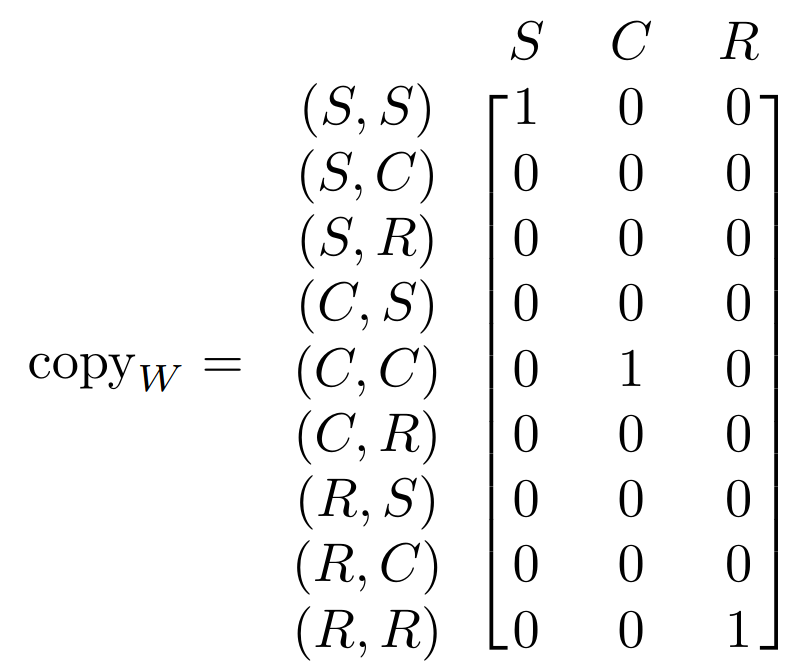

Adjoint School 2024 Subgroup 1B Blogpost

Drew, Nico, and Utku

# Introduction (this probably doesn't need a section title) (Drew)

We assume that the reader is familiar with symmetric monoidal categories and string diagrams. All of our string diagrams are to be read bottom to top.

* As said by Tomas, spell out the motivation here, and make sure readers know that there's a big reward at the end.
* Maybe an illustration? My motivator to learn this was the difference between the cumbersome algebra from my professor's notes (Section 9.4 of the attached estimation theory pdf) vs the simplicity of [Proposition 3.7 in this paper](https://arxiv.org/pdf/2401.14669)

# Basics of Probability Theory (UTKU)

Establish an example setting:

Weather, lawn sprinklers, and other

W = {Sunny, Cloudy, Rainy}
S = {On, Off}
P = {High, Low}
T = {Hot, Mild, Cold}

* Distributions
    * Show probability and possibility distributions in our example setting
    * Use bra-ket notation from example 2.4 in [this paper](https://arxiv.org/pdf/1709.00322)
* Markov Kernels
    * Probability and possibility
    * Show that these are Kleisli maps, segue into next section

# Kleisli Categories 
<!--
(Should this be a subsection of above? I think not) (NICO)
-->

If you are familiar with Kleisli categories, you might have uncovered $\mathbf{MultSet}$ from above as the Kleisli category of the normalized [powerset monad](https://math.stackexchange.com/questions/2994993/the-powerset-monad). <!-- $P$: it's objects are sets $X, Y$, its's morphisms are functions $f : X \to PY = \{ U \subseteq X \} $ --> In fact, it turns out that many Markov categories of interest arise as Kleisli categories of so-called *probability monads*, <!-- (see [this paper on representable Markov categories](https://arxiv.org/abs/2010.07416v3) for details),--> such as the *Giry monad*, *Radon monad*, or *distribution monads over semirings*. Rather than explaining (technical) details of these, we want to dive into the underlying construction.

If you do *not* know Kleisli categories--don't worry, we'll try to explain the relevant properties on the go. 

A Kleisli category is, in short, a category $\mathbf{C}$ together with a wide subcategory $\iota: \mathbf{C}_{det} \subset \mathbf{C}$ (`wide' means 'identity on objects') having a right adjoint: $\iota \dashv P$: we have a natural[^1] isomorphism

[^1]: natural between functors $\mathbf{C}_{det} \times \mathbf{C} \to \mathbf{Set}$, i.e. considering $\mathbf{C}_{det}$-morphisms as left input and $\mathbf{C}$-morphisms on the right.

$$\mathbf{C}(X,Y) \cong \mathbf{C}_{det}(X, PY)$$

If you have heard about Kleisli categories and are wondering 'where is the monad?!' --It's $P \iota : \mathbf{C}_{det} \to \mathbf{C}_{det}$ (with multiplication and unit, a.k.a flatten and dirac, induced by the adjunction).

**TODO:  explain that the object $PY$ is called "distribution object"?**

The subcategory $\mathbf{C}_{det}$ is called 'deterministic', as their morphisms are interpreted as 'deterministic processes'. We'll define the term later in detail, but call upon your intuition for now: a deterministic process has one (or multiple) output(s) being definitely determined by their input(s) (which may in fact be empty). In a sense, determenistic processes behave like functions (as in our first example) -- **TODO** -- or measurable functions (in our second). More generally speaking, the (sub)category of deterministic processes $\mathbf{C}_{det}$ is a *cartesian monoidal* category:

 1. it has a terminal object $I$:  every object $X$ has a unique *deleting process* $del_X : X \to I$. 

 3. it has products $X \times Y$ and projection pairs $X \xleftarrow{\pi_L} X \times Y \xrightarrow{\pi_R} Y$ satisfying the [universal property of the product](https://en.wikipedia.org/wiki/Product_(category_theory)). 

You probably know that these properties together induce a symmetric monoidal structure with tensored $\mathbf{C}_{det}$-morphisms, as indicated in **TODO: diagram**.

As explained above, (**TODO: Check** ) we want to model stochastic process in a process-oriented manner. But how to integrate the tensor structure from $\mathbf{C}_{det}$ to $\mathbf{C}$? We need help of *zipper functions* in $\mathbf{C}_{det}$
$$\nabla_{X,Y} : PX \times PY \to P(X \times Y)$$ 
being compatible with the product on $\mathbf{C}_{det}$ and the adjunction $\iota \dashv P$.[^2]  

[^2]:  to be precise, we require  $\nabla_{X,Y}$ to make $P \iota : \mathbf{C}_{det} \to \mathbf{C}_{det}$ a symmetric monoidal functor, such that multiplication and unit of the monad are monoidal natural transformations. 
We are still wondering, though, what this exactly means for our characterization of Kleisli categories as left adjoint wide inclusions $P \vdash \iota : \mathbf{C}_{det} \subset \mathbf{C}$.

Using the natural bijection $\mathbf{C}(X,Y) \cong \mathbf{C}_{det}(X, PY)$ from above, we say that morphisms $f \in \mathbf{C} (A, X)$ and $g \in \mathbf{C} (B, Y)$ are represented by deterministic $f_{det} \in \mathbf{C}_{det}(A, PX)$ and $g_{det} \in \mathbf{C}_{det}(B, PY)$, respectively. Their tensor product is then defined by its representant $$(f \otimes g)_{det} : A \times B \xrightarrow{f_{det} \times g_{det}} PX \times PY \xrightarrow{\nabla_{X,Y}} P(X \times Y).$$
In the examples from above, the zipper is given as ... **TODO**..., yielding symmetric monoidal categories ... **TODO**.

These examples are symmetric monoidal categories, but not cartesian monoidal: they do have products.

However, they satisfy point 1: the tensor unit $I$ is still terminal not only in $\mathbf{C}_{det}$, but also in $\mathbf{C}$. 

This property is important for Markov categories, as it allows for *weakened* products: every pair of morphisms $f \in \mathbf{C}( A, X)$ and $g \in \mathbf{C}(A, Y)$, gives rise to *at least* one morphisms making the product diagram commute, namely
$$A \xrightarrow{\iota \langle id_A, id_A \rangle} A \times A \xrightarrow{f \otimes g} X \times Y$$,
**TODO: should we explain this?**
where $\langle id_A, id_A \rangle \in \mathbf{C}_{det}(A, A \times A)$ is the "diagonal map" induced by the universal property. It will be called copy-map from now on, as it is given as ... **TODO** in our example categories ... **TODO**

These *weak products* are no categorical products, as they lack the uniqueness constraint.
<!-- a property we are used to in $\mathbf{Set}$, which does not hold, though in the Kleisli category $\mathbf{SetMulti}$ **TODO: name**, -->
Here is a (counter)example: **TODO**

From a probability theoretic words, this states that morphisms of the form $h: A \to X \times Y$ can in general not be recovered from their so-called marginalizations $\pi_L \circ f : A \to X$ and $\pi_R \circ f : A \to Y$, as the product space $X \times Y$ incorporates more "uncertainty" than its individual factors. (This stems back from $\nabla_{X,Y} : PX \times PY \to P(X \times Y)$ *not*  being isomorphic: recall that $PX$ is a "distribution object" describing the amount of different states on $X$.)
 

- example: $\mathbf{MultSet}_{det}=\mathbf{Set}$.

* Example probability monads (Construct `flatten`, `dirac`, and `zipper` for each)
    * Finite distribution monad
    * Powerset monad
    * Briefly mention giry monad
* Kleisli categories
    * What structures do the Kleisli categories lose (and what do they keep) from their base (Cartesian) counterparts?
        * They do keep comonoid structures
        * But they're no longer Cartesian
        * Copy map is no longer natural
        * Products are no longer categorical products, ie. projections are no longer universal. What does this mean in terms of probability? (Answer: unlike Cartesian projection, you cannot in general reconstruct a joint probability distribution from its marginals)
        * Delete is still natural though, ie. unit object is still final
        * This all plays into "equivalent characterizations of deterministic Markov categories"

# Markov Categories

## Formal definition

Let's start with the terse definition that category theorists love so much: A Markov category is a semiCartesian category where every object is a comonoid compatible with the monoidal structure.

(Now give a more explicit definition. Should we give both string diagram equations and commutative diagrams? Or just stick to one?)

## Each Axiom Explained

Let's go a little bit more in-depth into why each of these axioms are required.
(Bring in our established example setting into each of the subsections below.)

### Composition and Identity (Utku)

We want to describe how to "push forward" distributions

### Monoidal Products (Nico)

We want to describe distributions over joint variables.

### Swap Map (Drew)

### Copy Map (Drew)

We want this because it makes sense to process the same data in multiple different ways and then compare them.
Show for instance the "graph" of a morphism

Why should this be compatible with the monoidal structure?

Now if we remember, every object $$X$$ in a Markov category is a comonoid, meaning that it's equipped with a comultiplication morphism $$\mathrm{copy}_X :X \rightarrow X\otimes X$$, which we'll give the following string diagram:

We can think of it as a Markov kernel that takes an input $$x \in X$$ and outputs a Dirac delta distribution on its diagonal, $$\delta_{(x,x)} \in \mathcal{P}\ X\otimes X$$.
In our example, the copy morphism on our set of weather conditions forms the following stochastic matrix:

When a distribution is postcomposed with a copy, it will land on the diagonal in the joint space.
So for instance, if a distribution on weather states is $$p_W = 0.2 | \mathrm{Sunny} \rangle + 0.3 | \mathrm{Cloudy} \rangle + 0.5 | \mathrm{Rainy} \rangle$$, then we get $$\mathrm{copy}_W \circ p_W = 0.2 | \mathrm{(Sunny,Sunny)} \rangle + 0.3 | \mathrm{(Cloudy, Cloudy)} \rangle + 0.5 | \mathrm{(Rainy, Rainy)} \rangle$$

Cartesian categories come equipped with diagonal maps that do something very similar to this.
Paired with the projections, this makes all objects of Cartesian categories comonoids as well, and in fact all Cartesian categories are Markov categories, albeit probabilistically uninteresting ones since all morphisms are *deterministic* as we'll define later.
But if we have a probability monad on a Cartesian category, we can transport the diagonal maps into its Kleisli category, and these become precisely the copy maps.

Why do we want this comultiplication structure on our objects?
If we think of string diagrams as having pipes through which information flows, then it's useful to duplicate information and run different transformations on their parallel streams for comparison.
For instance, for a distribution $$p: I \rightarrow X$$ and kernel $$f: X \rightarrow Y$$, it's really common to generate a joint distribution on $$X$$s and $$Y$$s with the following diagram:

We sometimes call this a graph state because it works the exact same way for sets: the graph of a function $$f:X\rightarrow Y$$ is the set of tuples $$\{ (x, f(x)) : x\in X\}$$. The appearance of $$x$$ twice means that it must have been passed through a copy map, and the tuple $$(-, f(-))$$ represents the map $$\mathrm{id}\times f$$.

### Delete Map (Nico)

In probability theory: marginalization.
In information processing:deleting information seems desirable (even though impossible in quantum information theory)

Why should it be natural? Equivalently, why should the tensor unit be terminal?
In this sense, why should del be compatible with the monoidal structure?

* This corresponds to normalization
* Deleting an output of a process deletes the whole process
* Omitting this leads to CD-categories

## Important Markov categories

* The most important construction: Kleisli categories of symmetric monoidal monads
* FinSupStoch := Kl(D)
* Finstoch
* Gauss

## Additional Axioms and definitions (Drew)

Markov categories as we've built them so far form a great setting for probability, but the characters on stage have a lot more depth to them than just being stochastic kernels.
Many morphisms have relationships with each other that correspond to useful notions in traditional probability.

### Determinism

Looking back at Cartesian categories, there seems to be something special about them: all of their morphisms seem to be "deterministic," in that they map a single input to a single output.
This isn't a very categorical notion though, so let's try to find properties of Cartesian categories that encapsulate the idea that there's no uncertainty in the morphism outputs.

One unique property that Cartesian categories have over Markov categories is that their diagonal maps are natural in a certain sense.
Explicitly, if we equate the two inputs of the tensor product to form a "squaring" endofunctor $$- \otimes - : f \mapsto f\otimes f$$, then the collection of diagonal maps in a Cartesian category form a natural transformation $$\Delta : \mathrm{id} \rightarrow - \otimes -$$. The copy maps in a general Markov category do not follow the naturality square for all morphisms, which translates to the following string diagram:

This actually makes sense as a condition for a kernel to be deterministic!
If we really think about what uncertainty means, it boils down to the idea that many different outputs of a process could be possible given a single input.
Say the process maps pressure to weather state, and it's a low pressure day.
You could duplicate these exact pressure conditions on the other side of town, but the weather gods might decide to bless your neighbors with rain while they leave you only with cloud cover.
This would be different from copying your weather state and pasting it over your friend's house.
On the other hand, a deterministic process could be from weather to sprinkler, if it's always guaranteed to sprinkle when the sun is out.
If you and your friend have identical weather, there's no difference between each sprinkler having its own sun sensor or a single sensor controlling both.

Here's a concrete example with possibilistic states: Say the forecast today has $$p_W = \{\mathrm{Cloudy}, \mathrm{Rainy}\}$$ as possibilities.
If we copy this, we get $$\mathrm{copy}_W \circ p_W = \{(\mathrm{Cloudy}, \mathrm{Cloudy}), (\mathrm{Rainy}, \mathrm{Rainy})\}$$ which is not equal to $$p_W \otimes p_W = \{(\mathrm{Cloudy}, \mathrm{Cloudy}),(\mathrm{Cloudy}, \mathrm{Rainy}), (\mathrm{Rainy}, \mathrm{Cloudy}), (\mathrm{Rainy}, \mathrm{Rainy})\}$$.
On the other hand, we could look outside and determine the weather is certainly $$q_W = \{\mathrm{Rainy}\}$$.
Then copying and tensoring would both give us $$\mathrm{copy}_W \circ q_W = \{(\mathrm{Rainy}, \mathrm{Rainy})\}$$.

Only Cartesian categories have all-deterministic morphisms, and so we also call them deterministic Markov categories.
Further, all of the following are equivalent statemtents:

* A Markov category is deterministic
* Its copy map is natural
* It is Cartesian

Even though general Markov categories don't have all deterministic morphisms, they all at least have a few.
In fact, it's not hard to prove that copies, deletes, swaps, and identities are all deterministic themselves, and that determinism is closed under composition.
This means that the collection of deterministic morphisms form a wide subcategory of $$\mathsf{C}$$, which we call $$\mathsf{C}_{\mathrm{det}}$$, and that category is Markov itself!

### Conditionals, Bayesian Inversion

In traditional probability, we define a conditional probability as "the probability of one event given that another event is already known to have occurred."
This is constructed from a joint probability distribution, whose values are "renormalized" to the restriction of the known event.

For example, say the forecast for today given jointly for pressure and weather, and the data is given in the table below:

+-----------:+:--------:+:-------:+
|            | **High** | **Low** |
+------------+----------+---------+
| **Sunny**  | .1       |         |
+------------+----------+---------+
| **Cloudy** | .1       | .2      |
+------------+----------+---------+
| **Rainy**  |          | .6      |
+------------+----------+---------+

Say we have a barometer and now for a fact that the pressure outside is low.
With this updated information, what's our new estimate for the chance of rain?
We can calculate this by restricting our data to only the event of low pressure, and renormalizing that data to sum up again to 1.
Renormalization is easily done by dividing our values by the total probability of that restriction, which is $$.2 + .6 = .8$$.
So the chance of rain *given* that it's low pressure is $$.6/.8 = .75$$.

From here, we have a general formula for calculating conditional probability in the finite case:

$$p(y|x) = \frac{p(y,x)}{\sum_x p(y,x)}$$

where the traditional notation for the conditional probability of $$y$$ given $$x$$ is given by a pipe separating them.
If this looks exactly like the notation for stochastic kernels, this is no coincidence!
In fact, we can calculate these quantities for all outcomes to generate a stochastic kernel from $$P$$ to $$W$$:

$$ p_{|P} = 
\begin{bmatrix}
.5 & 0 \\
.5 & .25 \\
0 & .75 
\end{bmatrix}
$$

If the event $$A$$ is known to be true, then the conditional probability of event $$B$$ given $$A$$ is written as $$P(B|A)$$.
If this looks identical to our notation for stochastic kernels, this is no coincidence.

### Conditional Independence

In traditional probability, a joint distribution is said to be independent in its variables if it satisfies

$$P(x,y) = P(x)P(y)$$

for all $$x$$ and $$y$$.
There are actually many different forms of this condition.
The above was given in the finite case, but for general measure theoretic probability it 

What does this mean qualitatively?
And can we 

# Conclusion: Cool things you can do with Markov categories

* De Finetti
* HMMs and Bayesian Inversion
* Causal Inferencing
