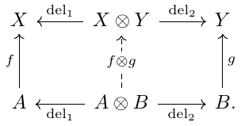
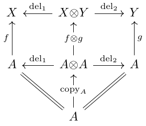

# Introduction to Categorical Probability

*Guest post by Utku Boduro&gbreve;lu, Drew McNeely, and Nico Wittrock*

*When is it appropriate to completely reinvent the wheel?*
To an outsider, that seems to happen a lot in category theory, and probability theory isn't spared from this treatment.
We've had a useful language to describe probability since the 17th century, and it works. Why change it up now?

This may be a tempting question when reading about categorical probability, but we might argue that this isn't completely reinventing traditional probability from the ground up.
Instead, we're developing a set of tools that allows us to work with traditional probability in a really powerful and intuitive way, and these same tools also allow us define new kinds of uncertainty where traditional probability is limited.
In this blog post, we'll work with examples of both traditional finite probability and nondeterminism, or *possibility* to show how they can be unified in a single categorical language.

----------------------------------------------------------

## Basics of Probability Theory (UTKU)

### Probability distributions
We want to proceed with our discussion through an example, and so before we introduce everything, consider the following:

> You've just installed a sprinkler system to your lawn! It is a very advanced piece of technology, measuring a myriad of different things to determine when to turn on the sprinklers... and you have no idea how it does this. In your effort to have an idea of when the system turns on (you pay the water bill, after all) you decided to keep track of how the weather feels and whether your sprinkler is on or not.

<!-- Do we want to include pressure in the example as well? -->
Here's what you have:
You make the following distinctions: 

```
    Weather = {sunny, cloudy, rainy}, 
    Humidity = {dry, humid},
    Temperature = {hot, mild, cold}, 
    Sprinkler = {on, off}
```

<!-- tables need to be arrays... not even HTML tables work :( -->
\[
    \begin{array}[t]{cccc}
    --Weather & Humidity & Temperature & Sprinkler--\\
    sunny & humid & mild & off \\
    sunny & dry & hot & on \\
    cloudy & dry & hot & on \\
    cloudy & humid & mild & on \\
    rainy & humid & cold & off \\
    cloudy & dry & cold & on \\
    sunny & humid & cold & off \\
    \end{array}
\]

> You make an assumption that the frequency with which each weather event occurred would be an accurate estimate for how it will be in the future, and so you assemble the previous 3 months' weather data into probability distributions.

We will be relating our definitions and examples to this theme of a lawn sprinkler system. To contextualize our examples, we provide some definitions.

A probability distribution on a finite set $X$ is a function $p: 2^X\to [0, 1]$ assigning to each subset $A\subset X$ a number $p(A)$ such that

* $p(\emptyset) = 0$,
* $p(X) = 1$,
* and for disjoint subsets $A_1,\dots, A_k \subset X$, $\sum_i p(A_i) = p(\bigcup_i A_i)$.

For our purposes, a simpler characterization exists from the fact that we can consider a set to disjointly consist of its individual points; namely we can think of a probability distribution on $X$ to be a function $p: X\to [0, 1]$ such that
\[
    \sum_{x\in X} p(x) = 1
\]


We will also make use of the [bra-ket notation]() to denote a distribution/state on $X$; for $X\coloneqq \{x_1,\dots,x_k\}$ with the values $\lambda_i \coloneqq p(x_i)$, the following notation also describes a distribution on $X$:
\[
    \sum_{i=1}^k \lambda_i = 1 \leftrightsquigarrow \lambda_1\mid x_1\rangle + \lambda_2\mid x_2\rangle + \dots + \lambda_k\mid x_k\rangle
\]


Given this notion, we can model the transition between "state spaces" $X$ to $Y$ by means of a [*stochastic matrix*](), which is a matrix $f: X\times Y \to [0,1]$ such that each column sums to 1, which we denote
\[
    \sum_{y\in Y} f(y\mid x) = 1
\]

Following our established bra-ket notation, we can equivalently describe the action of the channel $f: X\to Y$ by
\[
    f_x: \gamma_1 \mid y_1\rangle + \gamma_2 \mid y_2 \rangle + \dots + \gamma_n \mid y_n \rangle
\]
with $\gamma_i \coloneqq f(y_i\mid x)$ and $f_x$ forming a probability distribution on $Y$.


Furthermore, given two channels $f: X\to Y$ and $g: Y\to Z$, we also have a way of obtaining a composite channel $g\circ f: X\to Z$, by the [Chapman-Kolmogorov equation](), defining the channel
\[
    (g\circ f)(z\mid x) \coloneqq \sum_{y\in Y} g(z\mid y)f(y\mid x)
\]


You can interpret these distributions to be channels from the singleton set to their respective sets: $p: \ast \to W$, $q: \ast \to H$, $r: \ast \to T$.
Then, composing any such distribution with a channel will again yield a distribution
\[
    \ast \stackrel{p}{\to} X \stackrel{f}{\to} Y
\]

> Consider the example scenario we described above. Suppose that you compiled the historical weather data into the following probability distribution $p: \ast\to W\otimes H\otimes T$ (more to come about $\otimes$ in just a second):
\[
    p_\ast: 0.2\mid s,d,h\rangle + 0.3\mid r,h,c\rangle + 0.3\mid c,h,m\rangle + 0.2\mid c,d,h\rangle
\]

> From the table in the example, we can obtain the following channel $f: W\otimes H\otimes T \to S$ if we assume the principle of indifference, i.e., that the entries in the table all occur with equal probability (which would be the case if these were a list of observations<!--reword? -->), we get a channel
\[
    f_{(w,h,t)} = \delta_{wht}^\text{on} \mid \text{on} \rangle + \delta_{wht}^\text{off} \mid \text{off} \rangle
\]

Then, by everything we've established so far, we can reason about the likelihood that the sprinkler will turn on the next day by composing the state $p$ of the climate with the channel $f$ to obtain a state $f\circ p$ of the sprinkler, computed
\[
    f\circ p: 0.7\mid \text{on} \rangle + 0.3\mid \text{off} \rangle
\]

All in all, along with the identity matrices, all this data assembles into the category $\mathsf{FinStoch}$ with

* __objects__: finite sets
* __morphisms__: stochastic matrices
* where the composition is determined through the __Chapman-Kolmogorov equation__

This is one of the first examples of a Markov category that we will be looking at, and it will be a good baseline to observe why a Markov category is defined the way it is.

<!-- TODO: Should we remove these subheadings? They don't show up in the blog post renderer. -->
<!-- That's frustrating. Especially because we're actually supposed to use a level 1 heading for the title. -->
<!-- Let's keep headings for now for our internal organization maybe? -->
### Possibility distribution
Markov categories need not only house probabilistic models of uncertainty; we'll see that the following also forms a Markov category:

Consider a channel between two finite sets $X$, $Y$ to be an assignment $f: X\to Y$ such that each $f(x)\subset Y$ is a non-empty subset. Defining the composition to be
\[
g\circ f (x) \coloneqq \bigcup_{y\in f(x)} g(y) 
\]
and the identities as $x \mapsto \{x\}$ gives us the Markov category $\mathsf{FinSetMulti}$ of possibilities!

The same data from the example can be used in a possibilistic way as well; a channel $S \to W\otimes H\otimes T$ can map the sprinkler to all the possible states of weather/climate where the sprinkler has turned on etc. Then, a state is just a set of possible configurations, and the composed state $f\circ p$ is the set of all possible configurations one can reach from the initial configurations of $p$.

### Channels are Kleisli maps
Something you may have noticed from the two examples of morphisms of Markov categories is that fixing an element $x\in X$ yields some structure attached to $Y$ with "desirable properties": in the case of $\mathsf{FinStoch}$, we have that each $f_x$ is a probability distribution on $Y$ -- in fact, the Chapman-Kolmogorov formula further provides a way to obtain a probability distribution from a probability distribution of probability distributions. In the case of $\mathsf{FinSetMulti}$, each $f_x$ is a non-empty subset of $Y$, and the composition is provided through the union of a set of sets.

This is not a coincidence: we will see that for certain monads, the Kleisli category they yield turn out to be Markov categories! The monads in question will provide us descriptions of what the channels are, as well as the rule for composition. 

# Kleisli Categories 
<!--
(Should this be a subsection of above? I think not) (NICO)
-->

If you are familiar with Kleisli categories, you might have uncovered $\mathbf{MultSet}$ from above as the Kleisli category of the normalized [powerset monad](https://math.stackexchange.com/questions/2994993/the-powerset-monad). <!-- $P$: it's objects are sets $X, Y$, its's morphisms are functions $f : X \to PY = \{ U \subseteq X \} $ --> In fact, it turns out that many Markov categories of interest arise as Kleisli categories of so-called *probability monads*, <!-- (see [this paper on representable Markov categories](https://arxiv.org/abs/2010.07416v3) for details),--> such as the [Giry monad](https://ncatlab.org/nlab/show/Giry+monad), [Radon monad](https://ncatlab.org/nlab/show/Radon+monad), or [distribution monads over semirings](https://ncatlab.org/nlab/show/distribution+monad). Rather than explaining (technical) details of these, we want to dive into the underlying construction.

If you do *not* know Kleisli categories--don't worry, we'll try to explain it on the go, focusing on the relevant properties for our purpose. The idea is the following:

 1. take a cartesian monoidal category $\mathbf{D}$, representing *deterministic processes* and
 2. introduce *non-deterministic processes* as a [monadic effect](https://ncatlab.org/nlab/show/monad+%28in+computer+science%29#BasicIdea) by a probability monad $T : \mathbf{D} \to \mathbf{D}$
The [Kleisli category](https://en.wikipedia.org/wiki/Kleisli_category) $\mathbf{D}_T$ of $T$ has the same objects as $\mathbf{D}$, and morphisms $$\mathbf{D_T}(X,Y) := \mathbf{D}(X, TY) .$$ We call them *Kleisli maps*.

> For an example, recall the power set monad $P: \mathbf{Set} \to \mathbf{Set}$ from above.
<!-- **TODO** -->

While the latter example captures *possibility*, the following is the most general framework for *probability*:

> The Giry monad $G : \mathbf{Meas} \to \mathbf{Meas}$ on the (cartesian monoida) category of measurable spaces, sending a measurable space $X$ to the space $P X$ of distributions on it (a.k.a probability  measures). Its Kleisli morphisms are known as Markov kernels (hence the name Markov categories!): measurable functions $f: X \to P Y$, meaning that each point $x \in X$ is assigned a distribution $f_x$ on $Y$: normal distributions, uniform distribution,  [delta distribution (a.k.a Dirac measure)](https://ncatlab.org/nlab/show/Dirac+measure), ... Regard it as a stochastic process with input $X$ and probabilistic output $Y$. If the weather is sunny tomorrow, will the sprinkler switch on? Well, probably... In contrast, morphisms $X \to Y$ in $\mathbf{Meas}$ (i.e. measurable functions) are *deterministic*, as their output are points $f(x) \in Y$ being definitely determined by their input $x \in X$.
<!---
> Note two special cases:
> -  Kleisli maps $I \to X$ correspond to distributions over $X$.
> - Every *deterministic processes*, i.e. a (measurable) functions $f:X \to Y$, gives rise to a probabilistic process, by assinging delta distributions $f_x$ to each input $x \in X$. More formally, this yields an identy-on-objects functor $\mathbf{Meas} \to \mathbf{Meas}_P$.

More generally, it is known as the Kleisli functor $\mathrm{D} \to \mathrm{D}_T$, interpreting deterministic processes as probabilistic processes.
--->

A general definition of *determinism* in Markov categories follows below. Before, let's investigate the term *process*, by which we mean morphisms in a monoidal category: the usual composition amounts to the concatenation of processes, while the tensor product merges two subsystems into one, by running them "in parallel".

For our category $\mathbf{D}$ of "deterministic processes", this is straight forward; being *cartesian monoidal* means 

1. it has a terminal object $I$. <!-- Equivalently,  there are unique *deleting morphisms*  $del_X : X \to I$ being natural in $X$. -->
2. it has products $X \times Y$ and projection pairs $X \xleftarrow{\mathrm{out}^L} X \times Y \xrightarrow{\mathrm{out}^R} Y$ satisfying the universal property of the product: 
3. it has a symmetric monoidal structure is induced by 1. and 2.

Things are more complicated for the Kleisli category $D_T$: to get a tensor product, we need the monad $T$ to be [strong](https://ncatlab.org/nlab/show/commutative+monad), i.e. it comes with well behaving[^2]  *zipper functions* in $\mathbf{D}$
$$\nabla_{X,Y} : PX \times PY \to P(X \times Y).$$ 

[^2]:  to be precise, we require  $\nabla_{X,Y}$ to make $P \iota : \mathbf{C}_{det} \to \mathbf{C}_{det}$ a symmetric monoidal functor, such that multiplication and unit of the monad are monoidal natural transformations. 

Kleisli maps $f \in \mathbf{D}(A, TX)$ and $g \in \mathbf{D}(B, TY)$ may then be tensored as $$f \otimes g : A \times B \xrightarrow{f \times g} PX \times PY \xrightarrow{\nabla_{X,Y}} P(X \times Y).$$

> For the normalized power set-monad $P : \mathbf{Set} \to \mathbf{Set}$, the zipper maps two subsets $A \subseteq X$ and $B \subseteq Y$ to $\nabla_{X, Y} (A, B) := A \times B \subseteq X \times Y$. Kleisli maps $f: A \to PX$ and $g: B \to PY$ hence have the tensor product $$f \otimes g: (a, b) \mapsto f(a) \times g(b) \subseteq X \times Y .$$

> The zipper for the Giry monad $G : \mathbf{Meas} \to \mathbf{Meas}$ assigns the [product measure](https://en.wikipedia.org/wiki/Product_measure) $\mu {\otimes} \nu$ to probability measures $\mu$, $\nu$.
> Tensoring two Markov kernels $f: A \to GX$ and $g: B \to GY$ yields $$f \otimes g: (a, b) \mapsto f_a \otimes g_b .$$

In categorical terms, the induced symmetric monoidal structure on the Kleisli category $\mathbf{D}_T$ is such that the [Kleisli functor](https://en.wikipedia.org/wiki/Kleisli_category#Kleisli_adjunction) $Kl_T : \mathbf{D} \to \mathbf{D}_T$ is strict symmetric monoidal.

But we want more:[^10] we want the Kleisli functor to preserve the projection pairs $\mathrm{out}^{L/R}$, in that the following diagrams (in $\mathbf{D}_T$!) commute for $\mathrm{del}^{L/R} := Kl_T (\mathrm{out}^{L/R})$:


[^10]: So far, the Kleisli category is only a CD-category, but not a Markov category.

There are multiple equivalent requirements:

 - $\mathrm{del}^L$ and $\mathrm{del}^R$ are natural transformations;
 - $T$ preserves the terminal object $I \cong TI$ (in $\mathbf{D}$);
 - $I$ is a terminal object in $\mathbf{D}_T$, which is thus *semicartesian*.

As a consequence, $\mathbf{D}_T$ has *weak products*: any pair of Kleisli maps $f: A \to X$, $g: A \to Y$ factorizes jointly over $X \otimes Y$:

with the copy process of $A$ $$\mathrm{copy}_A := Kl_T (\langle \mathrm{id}_A, \mathrm{id}_A \rangle) \in \mathbf{D}_T (A, A \otimes A).$$ 

However, the vertical Kleisli map $A \to X \otimes Y$ in the last diagram is *not unique*--hence the term *semi*cartesian--, as the following example shows.

> In the Kleisli category of the Giry-monad, consider the uniform distributions on $X = \{\text{sunny}, \text{cloudy}, \text{rainy}\}$ and $Y = \{\text{on}, \text{off}\}$, i.e. Markov kernels $$f : \{\ast\} \to X, \quad \ast \mapsto \frac{1}{3} |\text{sunny} \rangle + \frac{1}{3} |\text{cloudy} \rangle + \frac{1}{3} |\text{rainy} \rangle$$$$g : \{\ast\} \to Y, \quad \ast \mapsto \frac{1}{2} |\text{on} \rangle + \frac{1}{2} |\text{off} \rangle.$$ Then the weak-product-diagram from above commutes for both of the distribution on $X {\times} Y$: $$\ast \mapsto \frac{1}{6} | \text{sunny, on} \rangle + \frac{1}{6} | \text{sunny, off} \rangle + \frac{1}{6} | \text{cloudy, on} \rangle + \frac{1}{6} | \text{cloudy, off} \rangle + \frac{1}{6} | \text{rainy, on} \rangle + \frac{1}{6} | \text{rainy, off} \rangle$$$$\ast \mapsto \frac{1}{3} | \text{sunny, on} \rangle + \frac{1}{3} | \text{cloudy, off} \rangle + \frac{1}{6} | \text{rainy, on} \rangle + \frac{1}{6} | \text{rainy, off} \rangle.$$ Which one is obtained as above via $\{\ast\} \xrightarrow{\mathrm{copy}} \{\ast\} \otimes \{\ast\} \xrightarrow{f \otimes g} X \otimes Y$?[^13]

[^13]: --it's the first one, i.e. the uniform distribution on $X \times Y$

In probability theory, this ambiguity is known as the fact that kernels to product spaces $h : A \to X \otimes Y$ are not determined by their marginalization $\mathrm{del}^L \circ h: A \to X$ and $\mathrm{del}^R \circ h: A \to Y$. From a more category theoretic perspective, it means that the family of copy morphisms is not natural.

Take a last look back on the weak-product diagram from above. The two triangles at the bottom mean that each $(A, \mathrm{copy}_A, \mathrm{del}_A)$ is a commutative comonoid in $\mathbf{D}_T$.
This leads us to the formal definition of Markov categories.

<!--
- in detail: 
	- adjunction
	- $\mathbf{C}(X,Y) \cong \mathbf{C}_{det}(X, PY) .$
		- examples: $P$, $G$
	- $D$ subcategory, cartesian -> deterministic processes
	- transfer to $C$: "zipper" (making $T$ a symmetric monoidal functor)
		- examples: $P$, $G$
		- $f \times g$
	- symmetric monoidal structure being not cartesian
		- examples: $P$, $G$
		- but weakly
- copy maps
	- $(X, copy, del)$ comonoids
	- $del$ natural
- non-properties
	- $copy$ natural
	- all Markov cats
-->


## Markov Categories

### Formal definition

Let's start with the terse definition that category theorists love so much: A Markov category is a semiCartesian category where every object is a commutative comonoid compatible with the monoidal structure.

In more detail, a Markov category is a symmetric monoidal category $(\mathbf{C}, \otimes, I)$ where each object is equipped with
- a *deletion map* $del_X : X \to I$ depicted as 


- a *copy map* $copy_X :X \to X \otimes  X$ depicted as 

 

such that

- the collection of deletion maps is natural:


  Equivalently, $I$ is required to be terminal. Hence, the deletion maps are compatible with the tensor product:


- the collection of copy maps is compatible with the symmetric monoidal structure


- each pair of copy and discard maps form a commutative comonoid:


### Each Axiom Explained

Let's go a little bit more in-depth into why each of these axioms are required.

#### Composition and Identity (Utku)
<!-- We want to describe how to "push forward" distributions -->
It is obvious why composition and identity is important to form a category. We note, however, that we want to think of constituents of a Markov category as states and channels that take states to states. So, in such a case, compositionality is important to be able to talk about "taking states to states", where for a state $p$, we wish for its "pushforward" $f_\ast(p) = f\circ p$ to be a state as well.

#### Monoidal Products (Nico)

We want to describe distributions over joint variables.

#### Swap Map (Drew)

#### Copy Map (Drew)

We can think of the copy map as a Markov kernel that takes an input $x \in X$ and outputs a Dirac delta distribution on its diagonal, $\delta_{(x,x)} \in \mathcal{P}\ X\otimes X$.
In our example, the copy morphism on our set of weather conditions forms the following stochastic matrix:

$$
copy_W =
\array{
 & \array{S & C & R} \\
\array{
(S,S) \\
(S,C) \\
(S,R) \\
(C,S) \\
(C,C) \\
(C,R) \\
(R,S) \\
(R,C) \\
(R,R) }
& \left [ \array{
1 & 0 & 0 \\
0 & 0 & 0 \\
0 & 0 & 0 \\
0 & 0 & 0 \\
0 & 1 & 0 \\
0 & 0 & 0 \\
0 & 0 & 0 \\
0 & 0 & 0 \\
0 & 0 & 1 } \right ]
}
$$

When a distribution is postcomposed with a copy, it will land on the diagonal in the joint space.
So for instance, if a distribution on weather states is $p_W = 0.2 | \mathrm{Sunny} \rangle + 0.3 | \mathrm{Cloudy} \rangle + 0.5 | \mathrm{Rainy} \rangle$, then we get $$\mathrm{copy}_W \circ p_W = 0.2 | \mathrm{Sunny},\mathrm{Sunny} \rangle + 0.3 | \mathrm{Cloudy},\mathrm{Cloudy} \rangle + 0.5 | \mathrm{Rainy},\mathrm{Rainy} \rangle$$

Cartesian categories come equipped with diagonal maps that do something very similar to this.
Paired with the projections, this makes all objects of Cartesian categories comonoids as well, and in fact all Cartesian categories are Markov categories. These don't make for very interesting categories in terms of probability though, since all morphisms are *deterministic* as we'll define later.
But if we have a probability monad on a Cartesian category, we can transport the diagonal maps into its Kleisli category, and these become precisely the copy maps.

Why do we want this comultiplication structure on our objects?
If we think of string diagrams as having pipes through which information flows, then it's useful to duplicate information and run different transformations on their parallel streams for comparison.
For instance, for a distribution $p: I \rightarrow X$ and kernel $f: X \rightarrow Y$, it's really common to generate a joint distribution on $X$s and $Y$s with the following diagram:


We sometimes call this a graph state because it works the exact same way for sets: the graph of a function $f:X\rightarrow Y$ is the set of tuples $\{ (x, f(x)) : x\in X\}$. The appearance of $x$ twice means that it must have been passed through a copy map, and the tuple $(-, f(-))$ represents the map $\mathrm{id}\times f$.

#### Delete Map (Nico)

In probability theory: marginalization.
In information processing:deleting information seems desirable (even though impossible in quantum information theory)

Why should it be natural? Equivalently, why should the tensor unit be terminal?
In this sense, why should del be compatible with the monoidal structure?

* This corresponds to normalization
* Deleting an output of a process deletes the whole process
* Omitting this leads to CD-categories
* leads to weak products.

### Important Markov categories

* The most important construction: Kleisli categories of symmetric monoidal monads
* FinSupStoch := Kl(D)
* Finstoch
* Gauss

### Additional Axioms and definitions (Drew)

Markov categories as we've built them so far form a great setting for probability, but the characters on stage have a lot more depth to them than just being stochastic kernels.
Many morphisms have relationships with each other that correspond to useful notions in traditional probability.

#### Determinism

Looking back at Cartesian categories, there seems to be something special about them: all of their morphisms seem to be "deterministic," in that they map a single input to a single output.
This isn't a very categorical notion though, so let's try to find properties of Cartesian categories that encapsulate the idea that there's no uncertainty in the morphism outputs.

One unique property that Cartesian categories have over Markov categories is that their diagonal maps are natural in a certain sense.
Explicitly, if we equate the two inputs of the tensor product to form a "squaring" endofunctor $- \otimes - : f \mapsto f\otimes f$, then the collection of diagonal maps in a Cartesian category form a natural transformation $\Delta : \mathrm{id} \rightarrow - \otimes -$. The copy maps in a general Markov category do not follow the naturality square for all morphisms, which translates to the following string diagram:


This actually makes sense as a condition for a kernel to be deterministic!
If we really think about what uncertainty means, it boils down to the idea that many different outputs of a process could be possible given a single input.
Say the process maps pressure to weather state, and it's a low pressure day.
You could duplicate these exact pressure conditions on the other side of town, but the weather gods might decide to bless your neighbors with rain while they leave you only with cloud cover.
This would be different from copying your weather state and pasting it over your friend's house.
On the other hand, a deterministic process could be from weather to sprinkler, if it's always guaranteed to sprinkle when the sun is out.
If you and your friend have identical weather, there's no difference between each sprinkler having its own sun sensor or a single sensor controlling both.

Here's a concrete example with possibilistic states: Say the forecast today has $p_W = \{\mathrm{Cloudy}, \mathrm{Rainy}\}$ as possibilities.
If we copy this, we get $\mathrm{copy}_W \circ p_W = \{(\mathrm{Cloudy}, \mathrm{Cloudy}), (\mathrm{Rainy}, \mathrm{Rainy})\}$ which is not equal to $p_W \otimes p_W = \{(\mathrm{Cloudy}, \mathrm{Cloudy}),(\mathrm{Cloudy}, \mathrm{Rainy}), (\mathrm{Rainy}, \mathrm{Cloudy}), (\mathrm{Rainy}, \mathrm{Rainy})\}$.
On the other hand, we could look outside and determine the weather is certainly $q_W = \{\mathrm{Rainy}\}$.
Then copying and tensoring would both give us $\mathrm{copy}_W \circ q_W = \{(\mathrm{Rainy}, \mathrm{Rainy})\}$.

Only Cartesian categories have all-deterministic morphisms, and so we also call them deterministic Markov categories.
Further, all of the following are equivalent statemtents:

* A Markov category is deterministic
* Its copy map is natural
* It is Cartesian

Even though general Markov categories don't have all deterministic morphisms, they all at least have a few.
In fact, it's not hard to prove that copies, deletes, swaps, and identities are all deterministic themselves, and that determinism is closed under composition.
This means that the collection of deterministic morphisms form a wide subcategory of $\mathsf{C}$, which we call $\mathsf{C}_{\mathrm{det}}$, and that category is Markov itself!

#### Conditionals, Bayesian Inversion

In traditional probability, we define a conditional probability as "the probability of one event given that another event is already known to have occurred."
This is constructed from a joint probability distribution, whose values are "renormalized" to the restriction of the known event.

For example, say the forecast for today given jointly for temperature and weather, and the data is given in the table below:

$$
p = 
\array{\arrayopts{\collines{solid} \rowlines{solid}}
 & \mathbf{Hot} & \mathbf{Cold} \\
\mathbf{Sunny}  & .1 & \\
\mathbf{Cloudy} & .1 & .2 \\
\mathbf{Rainy}  &    & .6
}
$$

Now if we feel that it's cold outside, what's our new estimate for the chance of rain?
We can calculate this by restricting our data to only the event of low pressure, and renormalizing that data to sum up again to 1.
Renormalization is easily done by dividing our values by the total probability of that restriction, which is $.2 + .6 = .8$.
So the chance of rain *given* that it's cold is $.6/.8 = .75$.

From here, we have a general formula for calculating conditional probability in the finite case:

$$p(y|x) = \frac{p(y,x)}{\sum_x p(y,x)}$$

where the traditional notation for the conditional probability of $y$ given $x$ is given by a pipe separating them.
If this looks exactly like the notation for stochastic kernels, this is no coincidence!
In fact, we can calculate these quantities for all outcomes to generate a stochastic kernel from $T$ to $W$:

$$ p_{|T} = 
\begin{bmatrix}
.5 & 0 \\
.5 & .25 \\
0 & .75 
\end{bmatrix}
$$

We give this kernel the same name as $p$ but with the subscript $|T$ to show that we turned $p$'s output into an input.

There are many different formulas for conditionals with respect to different kinds of probability, but how do we generalize this concept to cover all types of uncertainty, and put it in the language of our framework?
The key insight is to recognize that at the end, we were able to build a morphism from $T$ to $W$ that used the relationships between the two variables in $p$.
In fact the information contained in $p_{|T}$ gives it a special property which allows it to serve as sort of a "recovery process" for some data in $p$, as shown in the diagram below.

Imagine you've forgotten the weather portion of today's forecast, but you remember the predictions on what today's temperature will be. This is represented by the marginalization $p_T$.
If you've calculated this conditional kernel earlier and stored it as backup, then you can simply graph this out with your remaining data to fully restore the original information!
We'll use this as the basis for our definition, but we'll add parametrization with an input:

    **Definition.** Given a morphism $f:A \rightarrow X\otimes Y$, a conditional on $X$ which we call $f_{|X}$ is *any* morphism, $f_{|X}: A\otimes X \rightarrow Y$ which satisfies


which again can act as a recovery process from $X$ to $Y$ (parametrized by $A$) if the original data on $Y$ has been deleted.

Unfortunately conditional morphisms are difficult to find, are not unique, and might not even exist for a given kernel.
However if they do exist, then they are unique up to a certain equivalence called *almost sure equality*.
And there are many Markov categories which do have conditionals for every morphism (such as $\mathsf{BorelStoch}$, unlike $\mathsf{Stoch}$), and there are even several Markov categories for which we have closed-form solutions for conditionals.

To make string diagrams simpler, we often draw conditionals like so:


where we "bend the wire back" to signify which output has been turned into an input.
We should note though, this is only graphical sugar and does *not* represent some kind of "cap" morphism.
In fact, nontrivial compact closed Markov categories do not exist.
Conditionals also cannot be built up from compositions of other morphisms, so we put a dashed box around it to signify that the contents inside are "sealed off" from associating with other morphisms on the outside.
So when we draw a bunch of morphisms inside the dashed box, it means we're taking the conditional of the morphism resulting from composition of the smaller morphisms.
Even though the dash box seals the insides, luckily there are some properties of conditionals that allow us to do rewrites.
Bent wire notation makes these really nice:


where the $g$ in the bottom equation needs to be deterministic.

#### Conditional Independence

In traditional probability, a joint distribution is said to be independent in its variables if it satisfies $p(x,y) = p(x)p(y)$ for all $x$ and $y$.

So for instance, the following joint state on temperature and pressure is independent

$$
p = 
\array{\arrayopts{\collines{solid} \rowlines{solid}}
 & \mathbf{High}\ (.4) & \mathbf{Low}\ (.6) \\
\mathbf{Hot}\  (.8) & .32 & .48 \\
\mathbf{Cold}\ (.2) & .08 & .12 
}
$$

The marginals are shown with the labels, so you can see that each entry is the product of its marginals.

However, if we move just one speck of mass over from (High, Hot) to (Low, Hot), then it breaks independence:

$$
p = 
\array{\arrayopts{\collines{solid} \rowlines{solid}}
 & \mathbf{High}\ (.39) & \mathbf{Low}\ (.61) \\
\mathbf{Hot}\  (.8)  & .31 & .49 \\
\mathbf{Cold}\ (.2)  & .08 & .12 
}
$$

This traditional definition seems a little arbitrary, so what does this mean intuitively?
String diagrams can help here, and further they will allow us to generalize to any Markov category.
First, a very informal definition: we say that a morphism $p:A\rightarrow X\otimes Y$ displays independence in its outputs if its conditional doesn't use its bent-wire input at all.
We also say that its outputs are not correlated with each other, or they don't share mutual information.

Let's look at this more closely in string diagrams with a formal definition:

**Definition.** *A morphism $p:A\rightarrow X\otimes Y$ displays $X\perp Y || A$, read as "$X$ is independent of $Y$ given $A$", if its conditional can be calculated as*


This looks like the bent wire has just been snipped!
But if we look back to the definition of conditionals, this encapsulates the idea that there's no information about $Y$ contained in $X$.
If the conditional is a "data recovery" morphism that reconstructs $Y$ from the information it shares with $X$, then we notice two things:
one, the original $f$ has to be used in the condinional, which means the recovery morphism needs to store the entirety of $Y$'s original information to recover it.
And two, the $X$ input wire juts gets deleted, so it doesn't use any information from our unforgotten channels during recovery.
This means that whatever you know about $X$ isn't useful in reconstructing the information on $Y$.

If we do some string diagram manipulation, then we'll see that this reduces to the traditional definition of independence:


## Conclusion: Cool things you can do with Markov categories

So what can we do with all these constructions?
It's neat that we now have a graphical language to describe probability, and also we have a unifying language that describes all different types of uncertainty.
We've already done a lot of work in formulating traditional results in terms of Markov categories, which then generalizes these results to large classes of uncertainty representations.
For instance, we 

* De Finetti
* HMMs and Bayesian Inversion
* Causal Inferencing

