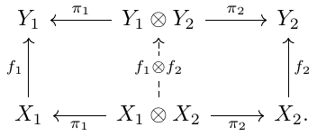

<!--
Then $\mathbf{C}$ is a *Kleisli category*, iff its objects coincide with those of $\mathbf{C}_{\mathrm{det}}$ and $\iota$ is the identity on objects.[^1]  This yields a natural[^2] isomorphism $$\mathbf{C}(X,Y) \cong \mathbf{C}_{det}(X, PY) .$$

TODO: Distribution object

[^1]: If you have heard about Kleisli categories and are wondering 'where is the monad?!' --it's $P \iota : \mathbf{C}_{det} \to \mathbf{C}_{det}$ (with multiplication and unit, a.k.a. flatten and Dirac, directly coming the adjunction).

[^2]: natural between functors $\mathbf{C}_{det} \times \mathbf{C} \to \mathbf{Set}$, i.e. considering $\mathbf{C}_{det}$-morphisms as left input and $\mathbf{C}$-morphisms on the right.

In the examples of interest, we have that

- $\mathbf{C}_{\mathrm{det}} \subset \mathbf{C}$ is a subcategory and $\iota f = f$ for all morphisms in $\mathbf{C}_{\mathrm{det}}$
- $\mathbf{C}_{\mathrm{det}}$ is *cartesian monoidal*:
	1. it has a terminal object $I$. Equivalently,  there are so-called *deleting morphisms*  $del_X : X \to I$ being natural in $X$.   
	 2. it has products $X \times Y$ and projection pairs $X \xleftarrow{\mathrm{out}^L} X \times Y \xrightarrow{\mathrm{out}^R} Y$ satisfying the [universal property of the product](https://en.wikipedia.org/wiki/Product_(category_theory)).   
	 3. it has a symmetric monoidal structure is induced by 1. and 2., with tensored $\mathbf{C}_{det}$-morphisms, as indicated in

In the examples from above ... **TODO**	

The object $PX \in \mathbf{C}_{det}$ is called "distribution object" describing the amount of uncertainty on $X$.
In the examples from above, ... **TODO**

The subcategory $\mathbf{C}_{det}$ is called 'deterministic', as their morphisms are interpreted as 'deterministic processes'. We'll define the term later in detail, but call upon your intuition for now: a deterministic process has one (or multiple) output(s) being definitely determined by their input(s) (which may, in fact, be empty).  **TODO: the following is described above?** They can be run "in parallel" (a.k.a tensored) and (eventually) "sequentially" (a.k.a. composed), using the symmetric monoidal structure on $\mathbf{C}_{det}$. 

How to integrate that to $\mathbf{C}$? 
--We need $P$ to be [strong](https://ncatlab.org/nlab/show/commutative+monad), i.e. it comes with *zipper functions* in $\mathbf{C}_{det}$
$$\nabla_{X,Y} : PX \times PY \to P(X \times Y)$$ 
being compatible with the product on $\mathbf{C}_{det}$ and the adjunction $\iota \dashv P$.[^3]  

[^3]:  to be precise, we require  $\nabla_{X,Y}$ to make $P \iota : \mathbf{C}_{det} \to \mathbf{C}_{det}$ a symmetric monoidal functor, such that multiplication and unit of the monad are monoidal natural transformations. 
We are still wondering, though, what this exactly means for our characterization of Kleisli categories as left adjoint wide inclusions $P \vdash \iota : \mathbf{C}_{det} \subset \mathbf{C}$.

Using the natural bijection $\mathbf{C}(X,Y) \cong \mathbf{C}_{det}(X, PY)$ from above, we say that morphisms $f \in \mathbf{C} (A, X)$ and $g \in \mathbf{C} (B, Y)$ are represented by deterministic $f_{det} \in \mathbf{C}_{det}(A, PX)$ and $g_{det} \in \mathbf{C}_{det}(B, PY)$, respectively. Their tensor product is then defined by its representant $$(f \otimes g)_{det} : A \times B \xrightarrow{f_{det} \times g_{det}} PX \times PY \xrightarrow{\nabla_{X,Y}} P(X \times Y).$$
Indeed, this defines a symmetric monoidal on $\mathbf{C}$ extending the cartesian monoidal structure on $\mathbf{C}_{det}$, in the sense that the inclusion $\iota : \mathbf{C}_{det} \subset \mathbf{C}$ is strict symmetric monoidal.[^9]
[^9]:  In order to prove that, note that deterministic morphisms $f  \in \mathbf{C}_{det}(X,Y)$ are represented by $f_{det} = Pf \circ \delta_{X} \in \mathbf{C}_{det}(X,PY)$, where $\delta$ the unit of the adjunction $\iota \dashv P$.

In the examples from above, the zipper is given as ... **TODO**..., yielding symmetric monoidal categories ... **TODO**.

These examples are symmetric monoidal categories, but not cartesian monoidal. As a (counter)example, consider two maps $f$, $g$ from  **TODO: is there already such an example?** both maps $h_1$ and $h_2$ make the diagram **TODO** commute.

In probability theoretic words, this states that a morphism of the form $h: A \to X \times Y$ carries more information than its so-called marginalizations $\mathrm{out}^L \circ h : A \to X$ and $\mathrm{out}^R \circ h : A \to Y$. The reason is that the product space $X \times Y$ incorporates more "uncertainty" than its individual factors. (Which stems back from $\nabla_{X,Y} : PX \times PY \to P(X \times Y)$ *not*  being isomorphic.)

Hence, clearly, our Kleisli categories $\mathbf{C}$ do not have products.
However, they satisfy point 1: the tensor unit $I$ is still terminal not only in $\mathbf{C}_{det}$, but also in $\mathbf{C}$. 

This property is important for Markov categories. <!-- (Actually, it's exactly the difference between Markov categories and CD categories.) --> In particular, it allows for *weakened* products: every pair of morphisms $f \in \mathbf{C}( A, X)$ and $g \in \mathbf{C}(A, Y)$, gives rise to *at least* one morphism making the product diagram commute, namely
$$A \xrightarrow{\langle id_A, id_A \rangle} A \times A \xrightarrow{f \otimes g} X \times Y,$$
where $\langle id_A, id_A \rangle \in \mathbf{C}_{det}(A, A \times A)$ is the "diagonal map" induced by the universal property. We are going to call it $copy_A$ from now on, as it is given as ... **TODO** in our example categories ... **TODO**

Note that the copy maps are compatible with the additional structure in the sense that $(A, copy_A, del_A)$ is a commutative comonoid in $\mathbf{C}$.
<!---
 - $\mathrm{out}^{L} \circ copy_A = id_A = \mathrm{out}^{R} \circ copy_A$
 -  $copy_A \otimes id_A \circ copy_A =id_A \otimes copy_A  \circ copy_A$
 - $swap_{A,A} \circ copy_A = copy_A$

[^4]: with $swap_{X,Y} :=  \langle \mathrm{out}^R, \mathrm{out}^L \rangle: X \times Y \to Y \times X$
--->
<!--- 
These *weak products* are no categorical products, as they lack the uniqueness constraint.
<!-- a property we are used to in $\mathbf{Set}$, which does not hold, though in the Kleisli category $\mathbf{SetMulti}$ **TODO: name**, 
--->

We are going to clarify in the next section what this means in detail; before, let's examine two properties that do *not* hold:

 1. The copy maps are *not* natural; 
 TODO: "check out the definition of 'determinism' later
 
 more precisely, a morphism $f \in \mathbf{C}(X,Y)$ satisfies $$f \otimes f \circ copy_X = copy_Y \circ f$$ if and only if $f$ is deterministic. 
This is not the case, for instance, with **TODO**
The above equation will serve as definition of "deterministic morphisms" in general Markov categories, as ...
 2. ... there are Markov categories that *do not* arise as Kleisli category: e.g., $\mathbf{FinStoch}$ of finite sets and Markov kernels does have $$\mathbf{FinStoch}_{det} = \mathbf{FinSet} \subset \mathbf{FinStoch}$$ as wide subcategory of deterministic morphisms, the inclusion cannot have a right adjoint (because the set $PX$ of distributions over $X$ is infinite).

 

**Original list of contents:**
* Example probability monads (**Construct `flatten`, `dirac`, and `zipper` for each. I dit not do that for `flatten`, `dirac`, due to that alternative characterization of Kleisli categories. Are you OK with that?**)
    * Finite distribution monad **TODO**
    * Powerset monad **TODO**
    * Briefly mention Giry monad **check**
* Kleisli categories
    * What structures do the Kleisli categories lose (and what do they keep) from their base (Cartesian) counterparts?
        * They do keep comonoid structures **check**
        * But they're no longer Cartesian **check**
        * Copy map is no longer natural  **check**
        * Products are no longer categorical products, ie. projections are no longer universal. What does this mean in terms of probability? (Answer: unlike Cartesian projection, you cannot in general reconstruct a joint probability distribution from its marginals) **check**
        * Delete is still natural though, ie. unit object is still final **check**
        * This all plays into "equivalent characterizations of deterministic Markov categories" **missing, but I don't know where to include that**

